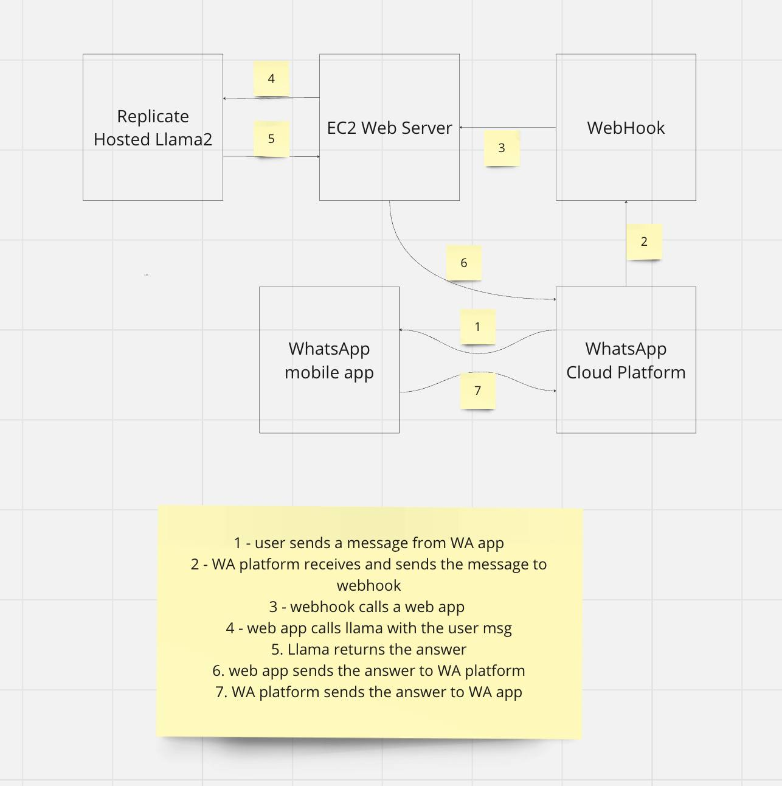
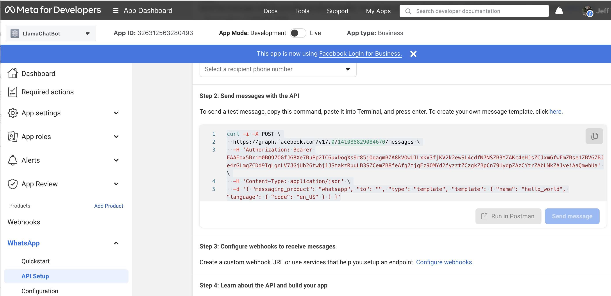

# Building a Llama-enabled WhatsApp Chatbot

This step-by-step tutorial shows the complete process of building a Llama-enabled WhatsApp chatbot. A demo video of using the iOS WhatsApp to send a question to a test phone number and receive the Llama 2 generated answer is [here](https://drive.google.com/file/d/1fZDaOsvyE1yrNGETV-e0SvL14BYeAI6R/view).

If you're interested in a Llama-enabled Messenger chatbot, see [here](messenger_llama2.md) for a tutorial.

## Overview

Businesses of all sizes can use the [WhatsApp Business API](https://developers.facebook.com/docs/whatsapp/cloud-api/overview) to connect their customers with human agents or Llama 2 powered chatbots. The benefits of an intelligent and knowledgable chatbot are obvious, including cost saving and better customer experience such as 24x7 availability. In this blog, we'll cover the details of integrating Llama 2 with the WhatsApp Business API to build a basic Llama 2 enabled chatbot - see [Llama 2 demo apps](https://github.com/facebookresearch/llama-recipes/tree/main/demo_apps) for more Llama 2 application development and deployment demos such as how to integrate your own data with Llama 2.

The diagram below shows the components and overall data flow of the Llama 2 enabled WhatsApp chatbot demo we built, using Amazon EC2 instance as an example for running the web server.



## Getting Started with WhatsApp Business Cloud API

First, open the [WhatsApp Business Platform Cloud API Get Started Guide](https://developers.facebook.com/docs/whatsapp/cloud-api/get-started#set-up-developer-assets) and follow the first four steps to:

1. Add the WhatsApp product to your business app;
2. Add a recipient number;
3. Send a test message;
4. Configure a webhook to receive real time HTTP notifications. 

For the last step, you need to further follow the [Sample Callback URL for Webhooks Testing Guide](https://developers.facebook.com/docs/whatsapp/sample-app-endpoints) to create a free account on glitch.com to get your webhook's callback URL.

Now open the [Meta for Develops Apps](https://developers.facebook.com/apps/) page and select the WhatsApp business app and you should be able to copy the curl command (as shown in the App Dashboard - WhatsApp - API Setup - Step 2 below) and run the command on a Terminal to send a test message to your WhatsApp. 



Note down the "Temporary access token", "Phone number ID", and "a recipient phone number" in the API Setup page above, which will be used later.

## Writing Llama 2 Enabled Web App

The Python-based web app we developed uses [LangChain](https://www.langchain.com/), an open source LLM development framework, and [Replicate](https://replicate.com/), a service provider hosting LLM models in the cloud, to receive the user query sent by the webhook, which will be covered in the next section, pass the query to Llama 2, and send the Llama 2 answer back to the webhook. For more information on how to use LangChain and Replicate to develop Llama 2 apps, see the [Llama 2 demo apps](https://github.com/facebookresearch/llama-recipes/tree/main/demo_apps) - you may also replace Replicate with other Llama deployment options shown in the demo apps.

First, let's create a new conda (or you can use venv if you like) environment and install all the required packages:

```
conda create -n whatsapp-llama python=3.8
conda activate whatsapp-llama
pip install langchain replicate flask requests uvicorn gunicorn
```

Then, create a Python file named llama_chatbot.py with the following code, which defines a class `WhatsAppClient` and a method `send_text_message` to post a message (the answer generated by Llama 2 on a user query) to the WhatsApp Cloud API, which then sends the answer back to the WhatsApp user. Remember to set `WHATSAPP_API_TOKEN` and `WHATSAPP_CLOUD_NUMBER_ID` to the values you saved in the previous section.

```
import langchain
from langchain.llms import Replicate
from flask import Flask
from flask import request
import os
import requests
import json

class WhatsAppClient:
    API_URL = "https://graph.facebook.com/v17.0/"
    WHATSAPP_API_TOKEN = "<Temporary access token from your WhatsApp API Setup>"
    WHATSAPP_CLOUD_NUMBER_ID = "<Phone number ID from your WhatsApp API Setup>"

    def __init__(self):
        self.headers = {
            "Authorization": f"Bearer {self.WHATSAPP_API_TOKEN}",
            "Content-Type": "application/json",
        }
        self.API_URL = self.API_URL + self.WHATSAPP_CLOUD_NUMBER_ID
        
    def send_text_message(self, message, phone_number):
        payload = {
            "messaging_product": 'whatsapp',
            "to": phone_number,
            "type": "text",
            "text": {
                "preview_url": False,
                "body": message
            }
        }
        response = requests.post(f"{self.API_URL}/messages", json=payload, headers=self.headers)
        return response.status_code
```

Finally, add the code below to llama_chatbot.py, which creates a Llama 2 instance and defines an HTTP method `msgrcvd` to:
1. receive the user message forwarded by the webhook;
2. ask Llama 2 for the answer;
3. call the `WhatsAppClient`'s `send_text_message`` with a recipient's phone number.
   
```   
os.environ["REPLICATE_API_TOKEN"] = "<your replicate api token>"    
llama2_13b_chat = "meta/llama-2-13b-chat:f4e2de70d66816a838a89eeeb621910adffb0dd0baba3976c96980970978018d"

llm = Replicate(
    model=llama2_13b_chat,
    model_kwargs={"temperature": 0.01, "top_p": 1, "max_new_tokens":500}
)
client = WhatsAppClient()
app = Flask(__name__)

@app.route("/")
def hello_llama():
    return "<p>Hello Llama 2</p>"

@app.route('/msgrcvd', methods=['POST', 'GET'])
def msgrcvd():    
    message = request.args.get('message')
    answer = llm(message)
    client.send_text_message(answer, "<a recipient phone number from your WhatsApp API Setup>")
    return message + "<p/>" + answer
```

The complete script of llama_chatbot.py is [here](llama_chatbot.py).

Now it's time to modify the webhook to complete the whole app.

## Modifying the Webhook 

Open your glitch.com webhook URL created earlier, and after the code snippet in app.js:

```
// message received! 
console.log(req.body["entry"][0]["changes"][0]["value"]["messages"][0]["text"]["body"]);
```

add the code below - remember to change <web server public IP>, which needs to be publicly visible, to the IP of the server where your Llama 2 enabled web app in the previous section runs:

```
  let url = "http://<web server public IP>:5000/msgrcvd?message=" + 
    req.body["entry"][0]["changes"][0]["value"]["messages"][0]["text"]["body"]

  axios.get(url)
    .then(response => {
      console.log(response.data);
    })
    .catch(error => {
      console.error('Axios error:', error);
    });
```

The code simply forwards the user message received by the WhatsApp Cloud Platform to the Llama 2 enabled web app llama_chatbot.py described in the previous section. Because the functionality of calling the WhatsApp Cloud API to send  a message has been implemented in the `send_text_message` in Python above, you can comment out the whole following code snippet in the original app.js:

```
  '// info on WhatsApp text message payload: https://developers.facebook.com/docs/whatsapp/cloud-api/webhooks/payload-examples#text-messages
  if (req.body.object) {
    ...
  }    
```

Note: It's possible and even recommended to implement a webhook in Python and call the Llama directly inside the webhook, instead of making an HTTP request, as the JavaScript code above does, to a Python app which calls Llama and sends the answer to WhatsApp.

## Running the Chatbot

On your web server, run the following command on a Terminal:

```
gunicorn -b 0.0.0.0:5000 llama_chatbot:app
```

If you use Amazon EC2 as your web server, make sure you have port 5000 added to your EC2 instance's security group's inbound rules. Write down your web server's public IP, update the URL below with it, then open the URL in a browser to verify you can see the answer sent to your WhatsApp app, as well as shown in the browser: 

```
http://<web server public IP>:5000/msgrcvd?message=who%20wrote%20the%20book%20godfather
```

Now you can open your WhatsApp app, enter a question and receive the Llama 2's answer shortly, as shown in the demo video in the beginning of this post.