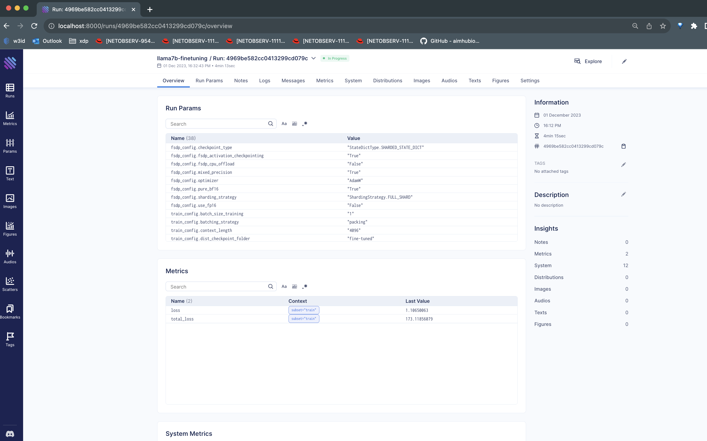
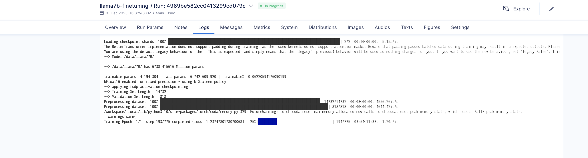
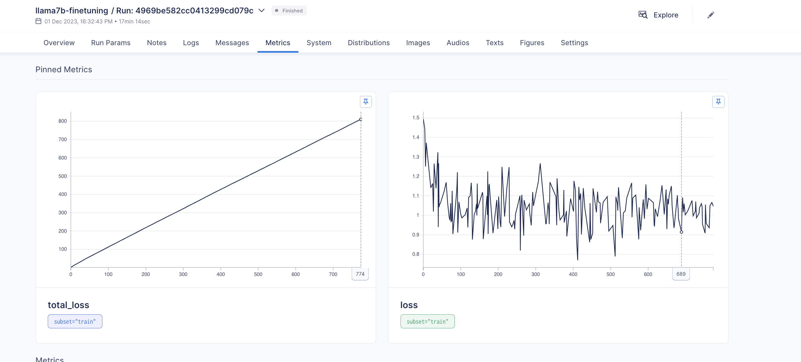

# Experiment tracking in llama recipes. 

Llama recipes has optional support for tracking experiments using experiment tracker modules like Aimstack or WandB (Currently only Aimstack is supported).

The experiment tracker can be enabled by passing `--tracker aim` to the finetuning script.
Experiment trackers record training, evaluation, and system metrics.

The addition argument can be passed as:

```
$ torchrun --nnodes 1 --nproc_per_node 1 examples/finetuning.py \
           --model_name MODEL_NAME --output_dir OUTPUT_DIR \
           --use_peft --peft_method lora --pure_bf16 \
           --tracker aim
```

Trackers integrated into llama recipes along with their support instructions are below.

## Aimstack (https://aimstack.io/)

Current version of the code supports Aimstack tracking via the trackers module.

One needs to install Aimstack separately if need to use aimstack as a tracker.

### Installation

Aim can be installed by running:

```
$ pip install aim==3.17.5
```

### Aim setup

Aimstack is a self hosted open source component so some setup is needed before using it.
After installing Aim you need to

1. Setup a local aim repo where the experiments will be tracked by running:

```
$ mkdir aimdb
$ cd aimdb
$ aim init
```

2. Start the Aimstack UI where you can visualize your runs. (run inside the aimdb folder):

```
$ aim up
```

You can visit the URL shown in the terminal (e.g. http://127.0.0.1:43800) to open Aimstack UI.

### Running llama-recipes with Aim as a tracker.

You can run the code with aimstack tracker by passing `--tracker aim` as an additional argument.

When specifying Aim as a tracker you need to tell your code to point to the same aim db which we setup
to track our experiments on our UI. You can do that by passing:

`--aim_config.repo <path-to-aimdb>`

You can categorize your experiments by passing a different name for each one in the command line using:

`--aim_config.experiment my_llama_experiment`

Final command with all this would look like:

```
torchrun --nnodes 1 --nproc_per_node 1 examples/finetuning.py \
           --model_name $MODEL_NAME --output_dir $OUTPUT_DIR \
           --use_peft --peft_method lora --pure_bf16 \
           --enable_fsdp --use_fast_kernels --num_epochs 1 --batch_size_training 1\
           --tracker aim --aim_config.repo $AIMSTACK_DB \
           --aim_config.experiment llama7b-finetuning
```

### Example screenshots.

This is what the runs look like: 

<div style="display: flex;">
    
</div>
<div style="display: flex;">
    
    
</div>

## WandB (https://wandb.ai)

Support to be added soon.