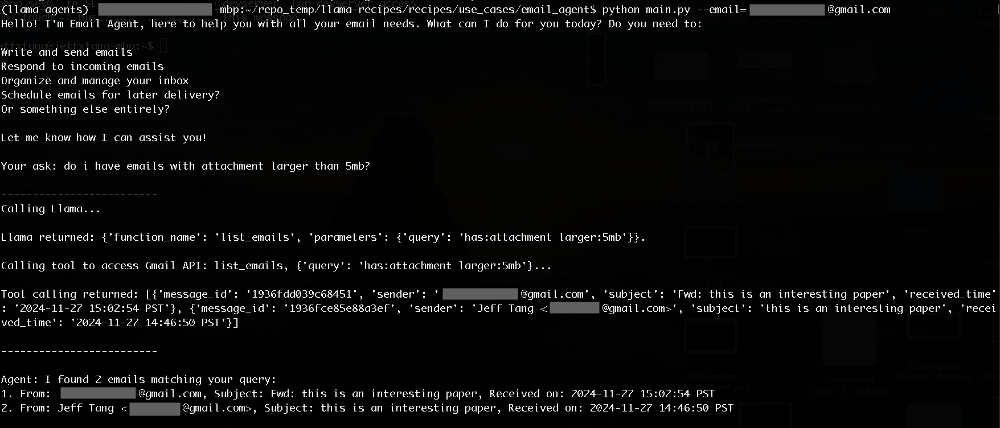

# Building A Llama Powered Email Agent

This app shows how to build an email agent powered by Llama 3.1 8B running locally via Ollama. We'll start with building from scratch a basic agent with custom tool calling natively supported in Llama 3.1. The end goal is to cover all components of a production-ready agent app, acting as an assistant to your email, with great user experience: intuitive, engaging, efficient and reliable. We'll use Gmail as an example but any email client API's can be used instead.

Currently implemented features include:
* search for emails and attachments
* get email detail
* reply to a specific email 
* forward an email
* get summary of a PDF attachment
* draft and send an email


# Overview

Email is an essential and one top killer app people use every day. A recent [State of AI Agents](https://www.langchain.com/stateofaiagents) survey by LangChain finds that "The top use cases for agents include performing research and summarization (58%), followed by streamlining tasks for personal productivity or assistance (53.5%)." 

Andrew Ng wrote a 5-part [Agentic Design Patterns](https://www.deeplearning.ai/the-batch/how-agents-can-improve-llm-performance/) in March 2024 predicting "AI agent workflows will drive massive AI progress this year". 

Deloitte published in November 2024 a report on [AI agents and multiagent systems](https://www2.deloitte.com/content/dam/Deloitte/us/Documents/consulting/us-ai-institute-generative-ai-agents-multiagent-systems.pdf) stating that "Through their ability to reason, plan, remember and act, AI agents address key limitations of typical language models." and "Executive leaders should make moves now to prepare for and embrace this next era of intelligent organizational transformation."

In the Thanksgiving week, a new startup [/dev/agent](https://sdsa.ai/) building the next-gen OS for AI agents was in the spotlight.

In December, Sequoia posted [here](https://www.linkedin.com/posts/konstantinebuhler_the-ai-landscape-is-shifting-from-simple-activity-7270111755710672897-ZHnr/) saying 2024 has been the year of agents (an agent is an AI that can complete tasks, not only tells you how to do it but also does it for you directly), and 2025 will be the year of networks of AI agents.

So what exactly is an AI agent and how to start building an agent app?

## What is an agent?

The concept of agent is not new - in the 2010 3rd edition of Russell and Norvig's classic book Artificial Intelligence: A Modern Approach ("Modern" by 2010, two years before the deep learning revolution that started the truly modern AI), an agent is defined as "anything that can be viewed as perceiving its environment through sensors and acting upon that environment through actuators". These days, AI agent basically means LLM-powered agent - well, if we treat natural language understanding as a type of sensor, LLM agent is still a sub-category of the traditional agent.

Lilian Weng in her popular June 2023 blog [LLM Powered Autonomous Agents](https://lilianweng.github.io/posts/2023-06-23-agent/) defines LLM-powered agent system to have four key components:
 * Planning and Reflection: can break down large tasks into smaller ones; can do self-reflection over past actions and self improve; 
 * Memory: can use contextual info and recall info over extended periods (for other components to use);
 * Tool Use: can understand what external APIs to use for info or action not built into LLMs;
 * Action: can actually run the tools.

Andrew Ng describes four [agentic design patterns](https://www.deeplearning.ai/the-batch/how-agents-can-improve-llm-performance/) as:
* Reflection
* Planning
* Tool calling
* Multi-agent collaboration, where "memory" is mentioned: Each agent implements its own workflow, has its own memory (itself a rapidly evolving area in agentic technology: how can an agent remember enough of its past interactions to perform better on upcoming ones?)

In Deloitte's [report](https://www2.deloitte.com/content/dam/Deloitte/us/Documents/consulting/us-ai-institute-generative-ai-agents-multiagent-systems.pdf), AI agents are reasoning engines that can understand context, plan workflows, connect to external tools and data, and execute actions to achieve a defined goal.

In a November 2024 blog by Letta [The AI agents stack](https://www.letta.com/blog/ai-agents-stack), LLM powered agent is described as the combination of tools use, autonomous execution, and memory.

In addition, Harrison Chase defines agent in the blog [What is an AI agent](https://blog.langchain.dev/what-is-an-agent/) as "a system that uses an LLM to decide the control flow of an application." 

Yet another simple [summary](https://www.felicis.com/insight/the-agentic-web) by Felicis of what an agent does is that an agent expands LLMs to go from chat to act: an agent can pair LLMs with external data, multi-step reasoning and planning, and act on the user's behalf. 

All in all (see [Resources](#resources) for even more info), agents are systems that take a high-level task, use an LLM as a reasoning and planning engine, with the help of contextual info and long-term memory if needed, to decide what actions to take, reflect and improve on the actions, and eventually execute those actions to accomplish the task.

It's time to see an agent app in action and enjoy some coding. Below is a preview of the questions or requests one may ask the agent:  

# Example Asks to Email Agent

* do i have any emails with attachments?
* what's the content of the email from LangSmith
* do i have emails with attachment larger than 1mb?
* what kind of attachments for the email with subject papers to read?
* give me a summary of the pdf thinking_llm.pdf
* Draft an email to xxx@gmail.com saying working on it and will keep you updated. thanks for your patience.
* send the draft
* do i have any emails with attachment larger than 10mb?
* how about 5mb
* reply to the email saying thanks for sharing! 
* forward the email to xxx@gmail.com
* how many emails do i have from xxx@gmail.com?
* how about from yyy@gmail.com?

Below are screenshots of some example interactions with the agent:



# Setup and Installation

If you feel intimated by the steps of the following Enable Gmail API section, you may want to check again the example asks (to see what you can ask to the agent) and the example log (to see the whole conversation with the agent) - the devil's in the detail and all the glorious description of a powerful trendy agent may not mention the little details one has to deal with to build it.

## Enable Gmail API
1. Go to the [Google Cloud Console](https://console.cloud.google.com/).
2. Create a new project by clicking the dropdown on the top left then click NEW PROJECT.
3. Enter a Project name then click CREATE.
4. Under "APIs & Services" > "Enabled APIs & services", search for "gmail" and then Enable the "Gmail API" for your project.
5. Under "APIs & Services" > "OAuth consent screen", click "GO TO NEW EXPERIENCE", then click "GET STARTED", enter App name, select your gmail as User support email, choose External under Audience, enter your gmail again as Contact Information, and finally check the I agree to the Google API Services under Finish and click Continue - Create. 
5. Again under "APIs & Services", go to Credentials. Click on + CREATE CREDENTIALS, then choose OAuth client ID (NOT API key).
Select Desktop App (NOT Web application, because you're assumed to want to start your Gmail agent locally first) as the application type and name it. Click Create to generate your client ID and client secret.
6. Click Download JSON and rename the downloaded file as credentials.json. This file will be used in your Python script for authentication.

## Install Ollama with Llama 3.1 8B

Download Ollama (available for macOS, Linux, and Windows) [here](https://ollama.com/). Then download and test run the Llama 3.1 8B model by running on a Terminal:
```
ollama run llama3.1
```

This will download a quantized version of Llama 3.1 of the size 4.7GB.

## Install required packages
First, create a Conda or virtual env:

```
conda create -n emailagent python=3.10
conda activate emailagent
```
or
```
python -m venv emailagent
source emailagent/bin/activate # on Linux, macOS:
source emailagent\Scripts\activate # on Windows
```

Then install the required Python libraries:
```
git clone https://github.com/meta-llama/llama-cookbook
cd llama-cookbook/end-to-end-use-cases/email_agent
pip install -r requirements.txt
```

# Run Email Agent

To run the agent, you need to first copy the `credentials.json` file downloaded and renamed above in Step 6 of Enable Gmail API to the email_agent folder, then run:
```
python main.py --email <your_gmail_address>
```

The first time you run it, you'll get a prompt like this;
```
Please visit this URL to authorize this application: https://accounts.google.com/o/oauth2/auth?response_type=code&client_id=xxxx
Enter the authorization code: 
```

You need to copy the URL above and open it in a browser - if you Sign in with Google using the same Gmail you enabled for the Gmail API, then you'll see "You’ve been given access to an app that’s currently being tested. You should only continue if you know the developer that invited you.", otherwise if you sign in with another Gmail, you'll see "Gmail Agent App has not completed the Google verification process. The app is currently being tested, and can only be accessed by developer-approved testers. If you think you should have access, contact the developer." 

In the latter case, go to APIs & Services > OAuth consent screen > Test users, and click the + ADD USERS button, and you'll see this message: While publishing status is set to "Testing", only test users are able to access the app. Allowed user cap prior to app verification is 100, and is counted over the entire lifetime of the app.

After clicking Continue, check the Select all checkbox to enable both settings required for running the agent:
```
View your email messages and settings. 
Manage drafts and send emails.
```

Finally, copy the Authorization code and paste it to the Terminal, hit Enter and you'll see the agent's initial greeting (which will likely differ because the default temperature value 0.8 is used here - see [Ollama's model file](https://github.com/ollama/ollama/blob/main/docs/modelfile.md#valid-parameters-and-values) for detail) such as:
```
Hello! I'm Email Agent, here to help you manage your email account with ease.

What would you like to do today? Do you want me to:

Check and respond to new emails
Compose a new email
Organize your inbox with filters or labels
Delete unwanted emails
Something else?

Let me know how I can assist you!

Your ask:
```

If you cancel here and run the command `python main.py --email <your_gmail_address>` again you should see the agent greeting right away without the need to enter an authorization code, unless you enter a different Gmail address for the first time - in fact, for each authorized (added as a test user) Gmail address, a file `token_xxxx@gmail.com.pickle` will be created which contains the authorized token.

See the example asks and interaction log above for the types of asks you may enter.

# Implementation Notes
Notes here mainly cover how custom functions are defined, how Gmail API based functions are implemented, and how an Agent class is defined to handle memory for contextual chat and perform pre- and post-processing on the tool calling.

## Available Custom Functions (Tools) Definition
The `functions_prompt.py` defines the following six custom functions, as part of the system prompt (along with examples for each function call spec that Llama should return):

* list_emails_function
* get_email_function
* send_email_function (new, reply, forward)
* get_pdf_summary_function
* create_draft_function
* send_draft_function

Below is an example function call spec in JSON format, for the user asks such as "do i have emails with attachments larger than 5mb", "any attachments larger than 5mb" or "let me know if i have large attachments over 5mb":
```
{"name": "list_emails", "parameters": {"query": "has:attachment larger:5mb"}}
```

Before LLMs, it'd be a REAL pain to cover ALL the possible user natural language inputs that can be and should be all translated into the same semantic representation (if you've done Amazon Alex Skill or Google Assistant development or any pre-LLM NLU work before, you'd know that the JSON format is the same as intent-slots representation). Now LLMs such as Llama do the most heavy lifting in translating a natural language open input into its semantic representation. 

But still, if you look at how the `list_emails_function` (which is used to search for emails based on a user query) is defined below, you'd see a lot of work would be needed to convert the user's asks to the filter values the Gmail API can accept:  

```
list_emails_function = """
{
    "type": "function",
    "function": {
        "name": "list_emails",
        "description": "Return a list of emails matching an optionally specified query.",
        "parameters": {
            "type": "dic",
            "properties": [
                {
                    "maxResults": {
                        "type": "integer",
                        "description": "The default maximum number of emails to return is 100; the maximum allowed value for this field is 500."
                    }
                },              
                {
                    "query": {
                        "type": "string",
                        "description": "One or more keywords in the email subject and body, or one or more filters. There can be 6 types of filters: 1) Field-specific Filters: from, to, cc, bcc, subject; 2) Date Filters: before, after, older than, newer than); 3) Status Filters: read, unread, starred, importatant; 4) Attachment Filters: has, filename or type; 5) Size Filters: larger, smaller; 6) logical operators (or, and, not)."
                    }
                }
            ],
            "required": []
        }
    }
}
"""
```
In fact, even though many hours of pre-processing work has been done to cover some test examples, not all of the examples in `functions_prompt.py`,have been covered and tested. 

## Actual Function Call Implementation

For each defined custom function call, its implementation using the Gmail API is present in `email_agent.py`. For example, the `list_emails` is defined as follows:

```
def list_emails(query='', max_results=100):
    emails = []
    next_page_token = None

    while True:
        response = service.users().messages().list(
            userId=user_id,
            maxResults=max_results,
            pageToken=next_page_token,
            q=query
        ).execute()
        
        if 'messages' in response:
            for msg in response['messages']:
                sender, subject, received_time = get_email_info(msg['id'])
                emails.append(
                    {
                        "message_id": msg['id'],
                        "sender": sender,
                        "subject": subject,
                        "received_time": received_time
                    }
                )
        
        next_page_token = response.get('nextPageToken')

        if not next_page_token:
            break
    
    return emails
```

The function will be called by our agent after a user ask such as "do i have emails with attachments larger than 5mb" gets Llama's response below: 
```
{"name": "list_emails", "parameters": {"query": "has:attachment larger:5mb"}}
 ```

## The Agent class
Implemented also in `email_agent.py`, the Agent class uses 3 instance members to allow for contextual aware asks to the agent, making it have short-term memory:
1. `messages`: this list holds all the previous user asks and the function call results based on Llama's response to the user asks, making Llama able to answer follow-up questions such as "how about 5mb" (after initial ask "attachments larger than 10mb") or "how about from yyy@gmail.com" (after ask "any emails from xxx@gmail.com).
2. `emails`: this list holds a list of emails that matches the user query, so follow-up questions such as "what kind of attachments for the email with subject xxx" can be answered. 
3. `draft_id`: this is used to handle the ask "send the draft" after an initial ask such as "draft an email to xxx".

The `__call__` method of `Agent` includes the call to Llama with the `messages` and parses the Llama response if it's a tool calling spec JSON result, or if Llama doesn't return a tool calling spec, it means it doesn't find a custom tool for the user ask so the Llama response is returned directly: 
```
    try:
      res = json.loads(result.split("<|python_tag|>")[-1])
      function_name = res['name']
      parameters = res['parameters']
      return {"function_name": function_name,
              "parameters": parameters}
    except:
      return result
```

Also implemented there are both pre-processing logic, mainly to convert some parameter values from Llama's responses to what Gmail APIs can accept to make the API calls happy, and post-processing logic to convert function call results to user-friendly natural language.

```
function_name = result["function_name"]
func = globals()[function_name]
parameters = result["parameters"]
... <pre-processing>
result = func(**parameters)
... <post-processing>
```

When you try out the app, you'll likely find that further pre- and post-processing still needed to make it production ready. In a great video on [Vertical LLM Agents](https://www.youtube.com/watch?v=eBVi_sLaYsc), Jake Heller said "after passes frankly even like 100 tests the odds that it will do on any random distribution of user inputs of the next 100,000, 100% accurately is very high" and "by the time you've dealt with like all the edge cases... there might be dozens of things you build into your application to actually make it work well and then you get to the prompting piece and writing out tests and very specific prompts and the strategy for how you break down a big problem into step by step by step thinking and how you feed in the information how you format that information the right way". That's what all the business logic is about. We'll cover decomposing a complicated ask and multi-step reasoning in a future version of the app, and continue to explore the best possible way to streamline the pre- and post-processing. 

## Debugging output

When running the app, the detailed Llama returns, pre-processed tool call specs and the actual tool calling results are inside the `-------------------------` block, e.g.:

-------------------------
Calling Llama...

Llama returned: {'function_name': 'list_emails', 'parameters': {'query': 'subject:papers to read has:attachment'}}.

Calling tool to access Gmail API: list_emails, {'query': 'subject:papers to read has:attachment'}...

Tool calling returned: [{'message_id': '1936ef72ad3f30e8', 'sender': 'xxx@gmail.com', 'subject': 'Fwd: papers to read', 'received_time': '2024-11-27 10:51:51 PST'}, {'message_id': '1936b819706a4923', 'sender': 'Jeff Tang <xxx@gmail.com>', 'subject': 'papers to read', 'received_time': '2024-11-26 18:44:19 PST'}]

-------------------------


# TODOs

1. Port the app to using [Llama Stack](https://github.com/meta-llama/llama-stack) Agents API.
2. Improve the search, reply, forward, create email draft, and query about types of attachments.
3. Improve the fallback and error handling mechanism when the user asks don't lead to a correct function calling spec or the function calling fails. 
4. Improve the user experience by showing progress when some Gmail search API calls take long (minutes) to complete.
5. Implement the async behavior of the agent - schedule an email to be sent later.
6. Implement the agent planning - decomposing a complicated ask into sub-tasks, using ReAct and other methods.
7. Implement the agent long-term memory - longer context and memory across sessions (consider using Llama Stack/MemGPT/Letta)
8. Implement reflection - on the tool calling spec and results.
9. Introduce multiple-agent collaboration.
10. Implement the agent observability. 
11. Compare different agent frameworks using the app as the case study.
12. Add and implement a test plan and productionize the app.


# Resources
1. Lilian Weng's blog [LLM Powered Autonomous Agents](https://lilianweng.github.io/posts/2023-06-23-agent/) 
2. Andrew Ng's posts [Agentic Design Patterns](https://www.deeplearning.ai/the-batch/how-agents-can-improve-llm-performance/) with basic [implementations from scratch](https://github.com/neural-maze/agentic_patterns).
3. LangChain's survey [State of AI Agents](https://www.langchain.com/stateofaiagents)
4. Deloitte's report [AI agents and multiagent systems](https://www2.deloitte.com/content/dam/Deloitte/us/Documents/consulting/us-ai-institute-generative-ai-agents-multiagent-systems.pdf)
5. Letta's blog [The AI agents stack](https://www.letta.com/blog/ai-agents-stack)
6. Microsoft's multi-agent system [Magentic-One](https://www.microsoft.com/en-us/research/articles/magentic-one-a-generalist-multi-agent-system-for-solving-complex-tasks)
7. Amazon's [Multi-Agent Orchestrator framework](https://awslabs.github.io/multi-agent-orchestrator/)
8. Deeplearning.ai's [agent related courses](https://www.deeplearning.ai/courses/?courses_date_desc%5Bquery%5D=agents) (Meta, AWS, Microsoft, LangChain, LlamaIndex, crewAI, AutoGen, Letta) and some [lessons ported to using Llama](https://github.com/meta-llama/llama-cookbook/tree/main/end-to-end-use-cases/agents/DeepLearningai_Course_Notebooks). 
9. Felicis's [The Agentic Web](https://www.felicis.com/insight/the-agentic-web)
10. A pretty complete [list of AI agents](https://github.com/e2b-dev/awesome-ai-agents), not including [/dev/agents](https://sdsa.ai/), a very new startup building the next-gen OS for AI agents, though.
11. Sequoia's [post](https://www.linkedin.com/posts/konstantinebuhler_the-ai-landscape-is-shifting-from-simple-activity-7270111755710672897-ZHnr/) on 2024 being the year of AI agents and 2025 networks of AI agents.
