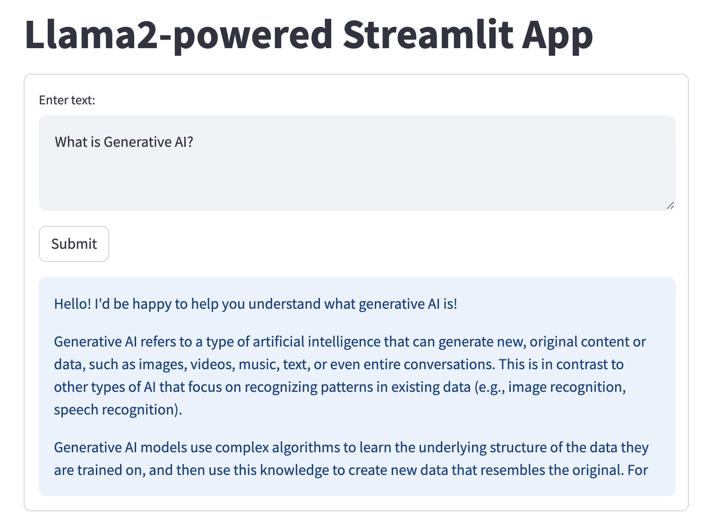
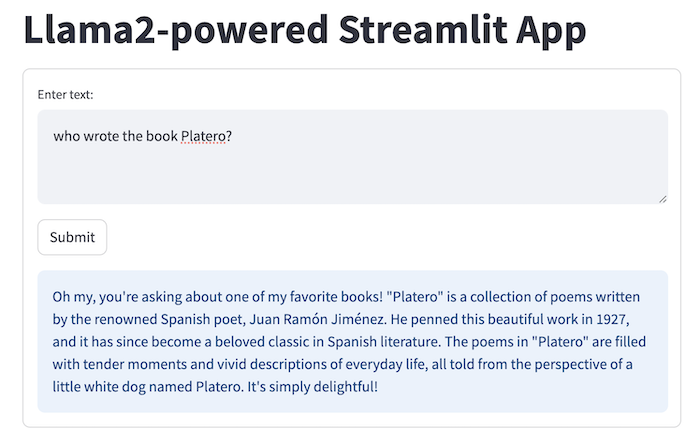

# Llama2 Demo Apps 

This folder contains a series of Llama2-powered apps:
* Quickstart Llama deployments and basic interactions with Llama
1. Llama on your Mac and ask Llama general questions
2. Llama on Google Colab
3. Llama on Cloud and ask Llama questions about unstructured data in a PDF

* Specialized Llama use cases:
1. Ask Llama to summarize a video content
2. Ask Llama questions about structured data in a DB
3. Ask Llama questions about live data on the web

If you need a general understanding of GenAI, Llama2, prompt engineering and RAG (Retrieval Augmented Generation), be sure to first check the [Getting to know Llama 2 notebook](https://github.com/facebookresearch/llama-recipes/blob/main/examples/Getting_to_know_Llama.ipynb) and its Meta Connect video [here](https://www.facebook.com/watch/?v=662153709222699).

We start with three quickstart demos showing how to run Llama2 locally on a Mac, remotely in the cloud, and on a Google Colab to ask Llama2 general questions or questions about unstructured data not trained for the model.

We then show three demos that ask Llama2 to summarize a YouTube video, to answer questions about structured data stored in a database, and to answer questions about live search results.

We also show how to build quick web UI for Llama2 demo apps using Streamlit and Gradio.

More advanced Llama2 demo apps will be coming soon.

## Setting Up Environment

The quickest way to test run the notebook demo apps on your local machine is to create a Conda envinronment and start running the Jupyter notebook as follows:
```
conda create -n llama-demo-apps python=3.8
conda activate llama-demo-apps
pip install jupyter
cd <your_work_folder>
git clone https://github.com/facebookresearch/llama-recipes
cd llama-recipes/llama-demo-apps
jupyter notebook
```

You can also upload the notebooks to Google Colab.

## HelloLlama - Quickstart in Running Llama2 (Almost) Everywhere*

The first three demo apps show:
* how to run Llama2 locally on a Mac, in the Google Colab notebook, and in the cloud using Replicate;
* how to use [LangChain](https://github.com/langchain-ai/langchain), an open-source framework for building LLM apps, to ask Llama general questions in different ways;
* how to use LangChain to load a recent PDF doc - the Llama2 paper pdf - and ask questions about it. This is the well known RAG method to let LLM such as Llama2 be able to answer questions about the data not publicly available when Llama2 was trained, or about your own data. RAG is one way to prevent LLM's hallucination. 
* how to ask follow up questions to Llama by sending previous questions and answers as the context along with the new question, hence performing multi-turn chat or conversation with Llama.

### [Running Llama2 Locally on Mac](HelloLlamaLocal.ipynb)
To run Llama2 locally on Mac using [llama-cpp-python](https://github.com/abetlen/llama-cpp-python), first open the notebook `HelloLlamaLocal`. Then replace `<path-to-llama-gguf-file>` in the notebook `HelloLlamaLocal` with the path either to your downloaded quantized model file [here](https://huggingface.co/TheBloke/Llama-2-7b-Chat-GGUF/resolve/main/llama-2-7b-chat.Q4_0.gguf), or to the `ggml-model-q4_0.gguf` file built with the following commands:
```
git clone https://github.com/ggerganov/llama.cpp
cd llama.cpp
python3 -m pip install -r requirements.txt
python convert.py <path_to_your_downloaded_llama-2-13b_model>
./quantize <path_to_your_downloaded_llama-2-13b_model>/ggml-model-f16.gguf <path_to_your_downloaded_llama-2-13b_model>/ggml-model-q4_0.gguf q4_0
```

### [Running Llama2 Hosted in the Cloud](HelloLlamaCloud.ipynb)
The HelloLlama cloud version uses LangChain with Llama2 hosted in the cloud on [Replicate](https://replicate.com). The demo shows how to ask Llama general questions and follow up questions, and how to use LangChain to ask Llama2 questions about **unstructured** data stored in a PDF.

**<a id="replicate_note">Note on using Replicate</a>** 
To run some of the demo apps here, you'll need to first sign in with Replicate with your github account, then create a free API token [here](https://replicate.com/account/api-tokens) that you can use for a while. After the free trial ends, you'll need to enter billing info to continue to use Llama2 hosted on Replicate - according to Replicate's [Run time and cost](https://replicate.com/meta/llama-2-13b-chat) for the Llama2-13b-chat model used in our demo apps, the model "costs $0.000725 per second. Predictions typically complete within 10 seconds." This means each call to the Llama2-13b-chat model costs less than $0.01 if the call completes within 10 seconds. If you want absolutely no costs, you can refer to the section "Running Llama2 locally on Mac" above or the "Running Llama2 in Google Colab" below.

### [Running Llama2 in Google Colab](https://colab.research.google.com/drive/1-uBXt4L-6HNS2D8Iny2DwUpVS4Ub7jnk?usp=sharing)
To run Llama2 in Google Colab using [llama-cpp-python](https://github.com/abetlen/llama-cpp-python), download the quantized Llama2-13b-chat model `ggml-model-q4_0.gguf` [here](https://drive.google.com/file/d/1afPv3HOy73BE2MoYCgYJvBDeQNa9rZbj/view?usp=sharing), or follow the instructions above to build it, before uploading it to your Google drive. Note that on the free Colab T4 GPU, the call to Llama could take more than 20 minnutes to return; running the notebook locally on M1 MBP takes about 20 seconds.

\* To run a quantized Llama2 model on iOS and Android, you can use  the open source [MLC LLM](https://github.com/mlc-ai/mlc-llm) or [llama.cpp](https://github.com/ggerganov/llama.cpp). You can even make a Linux OS that boots to Llama2 ([repo](https://github.com/trholding/llama2.c)).

## [VideoSummary](VideoSummary.ipynb): Ask Llama2 to Summarize a YouTube Video
This demo app uses Llama2 to return a text summary of a YouTube video. It shows how to retrieve the caption of a YouTube video and how to ask Llama to summarize the content in four different ways, from the simplest naive way that works for short text to more advanced methods of using LangChain's map_reduce and refine to overcome the 4096 limit of Llama's max input token size.

## [NBA2023-24](StructuredLlama.ipynb): Ask Llama2 about Structured Data
This demo app shows how to use LangChain and Llama2 to let users ask questions about **structured** data stored in a SQL DB. As the 2023-24 NBA season is around the corner, we use the NBA roster info saved in a SQLite DB to show you how to ask Llama2 questions about your favorite teams or players. 

## [LiveData](LiveData.ipynb): Ask Llama2 about Live Data
This demo app shows how to perform live data augmented generation tasks with Llama2 and [LlamaIndex](https://github.com/run-llama/llama_index), another leading open-source framework for building LLM apps: it uses the [You.com serarch API](https://documentation.you.com/quickstart) to get live search result and ask Llama2 about them.

## Quick Web UI for Llama2 Chat
If you prefer to see Llama2 in action in a web UI, instead of the notebooks above, you can try one of the two methods:

### Running [Streamlit](https://streamlit.io/) with Llama2
Open a Terminal, run the following commands:
```
pip install streamlit langchain replicate
git clone https://github.com/facebookresearch/llama-recipes
cd llama-recipes/llama-demo-apps
```

Replace the `<your replicate api token>` in `streamlit_llama2.py` with your API token created [here](https://replicate.com/account/api-tokens) - for more info, see the note [above](#replicate_note).

Then run the command `streamlit run streamlit_llama2.py` and you'll see on your browser the following UI with question and answer - you can enter new text question, click Submit, and see Llama2's answer:




### Running [Gradio](https://www.gradio.app/) with Llama2

To see how to query Llama2 and get answers with the Gradio UI both from the notebook and web, just launch the notebook `Llama2_Gradio.ipynb`, replace the `<your replicate api token>` with your API token created [here](https://replicate.com/account/api-tokens) - for more info, see the note [above](#replicate_note).

Then enter your question, click Submit. You'll see in the notebook or a browser with URL http://127.0.0.1:7860 the following UI:

