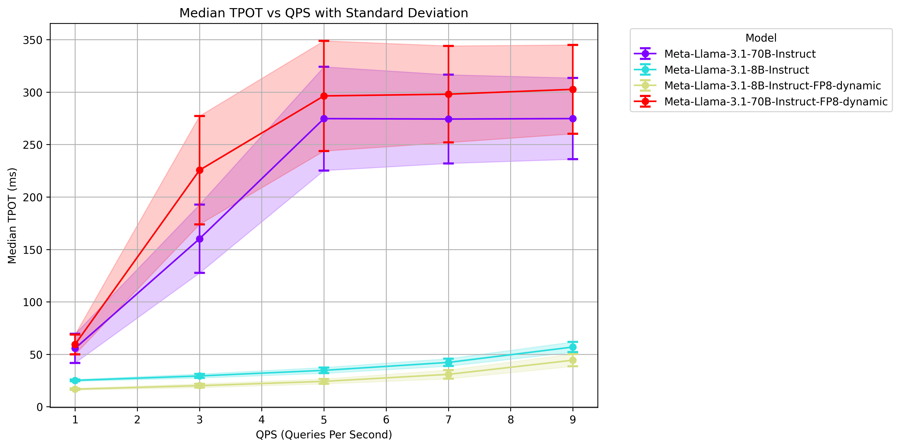
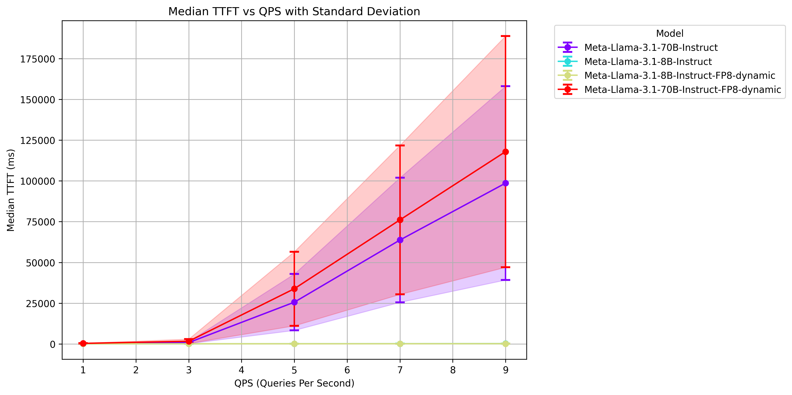

In this article, we will show how to benchmark FP8 models on L40S using the vLLM inference engine. At the end, you should have an understanding of how to use `llm-compressor` to create quantize existing Llama3 finetunes in higher precision to fp8, benchmark throughput and latency to compare performance, and finally serve models using `vllm`.

# Provisioning Resources
First, navigate to this repository from your local machine. Update the corresponding variables in `locals` inside `main.tf` to match your environment (e.g. the path to your SSH key), then initialize the terraform project with `terraform init` and provision resources with `terraform apply`. Note that this will create a VM equipped with 8xL40S and a 256GB persistent disk. After the VM has been created, terraform will output the public IP address.

## Mount Storage
`ssh` into your VM. Then, run the below commands to mount the attached disk to `/scratch`.
```bash
mkfs.ext4 /dev/vdb
mkdir /scratch
mount -t ext4 /dev/vdb /scratch
cd /scratch
```

# Install Dependencies
We'll use [uv](https://github.com/astral-sh/uv) to install dependencies. First, install the tool with
```bash
apt-get update && apt-get install -y curl
apt-get install tmux
curl -LsSf https://astral.sh/uv/install.sh | sh
source $HOME/.cargo/env
```

Now, clone the recipes and navigate to this tutorial. Initialize the virtual environment and install dependencies:
```bash
git clone https://github.com/meta-llama/llama-recipes.git
cd llama-recipes/recipes/3p_integrations/crusoe/vllm-fp8/
uv add vllm setuptools
```

# Run Benchmarks
Before starting the vLLM server, we'll configure HuggingFace to save to our shared disk, specify the model tag, and set tensor parallelism to 1.
```bash
export HF_HOME=/scratch/
export MODEL=neuralmagic/Meta-Llama-3.1-8B-Instruct-FP8-dynamic
export TP_SIZE=1
```
Now, we'll use tmux to run our server inside of a detachable session.
```bash
tmux new -s server
uv run vllm serve $MODEL --enable-chunked-prefill --disable-log-requests --tensor-parallel-size $TP_SIZE
```
vLLM will download the model from HF and serve it on port 8000. Now, detach from the tmux session (`ctrl+b` then `d`) and we'll simulate a client.
```bash
tmux new -s client
chmod +x run_benchmark.sh
./run_benchmark.sh
```
Let's inspect the benchmark script to see what's going on.
```bash
TOTAL_SECONDS=120
QPS_RATES=("1" "3" "5" "7" "9")

for QPS in ${QPS_RATES[@]}; do
    NUM_PROMPTS=$((TOTAL_SECONDS * QPS))
    echo "===== RUNNING NUM_PROMPTS = $NUM_PROMPTS QPS = $QPS ====="

    uv run benchmarks/benchmark_serving.py \
        --model $MODEL \
        --dataset-name sonnet --sonnet-input-len 550 --sonnet-output-len 150 --dataset-path benchmarks/sonnet.txt \
        --num-prompts $NUM_PROMPTS --request-rate $QPS --save-result
done
```
This is a convenience wrapper that re-runs the vLLM `benchmarks/benchmark_serving.py` with queries-per-second (QPS) gradually increasing from 1 to 9 and saves the results. After each run completes, a JSON will appear in the same directory containing inference statistics.

# Results
We repeated the above benchmark across the fp8 and fp16 versions of both Llama3.1 8B and 70B.


In the above chart, we compare time-per-output-token (TPOT) across different QPS volumes. For fp16 70B we run across 8 GPUs while in fp8 we only use 4 and we still maintain the same TPOT range. The 8B models are run across 1 GPU though fp8 is noticeably faster.


Looking at our time-to-first-token (TTFT), we observe the same trends. Even though the fp8 70B is run across half as many GPUs, its TTFT is roughly the same as the fp16 version on 8.

# Converting Llama3 models to FP8
If you wish to convert your existing finetunes to FP8, we can easily achieve this using [llmcompressor](https://github.com/vllm-project/llm-compressor).
```bash
uv add llmcompressor
uv run convert_hf_to_fp8.py NousResearch/Hermes-3-Llama-3.1-70B
```

To use the converted model, update `$MODEL` to your absolute path for the converted version, then rerun `uv run vllm serve $MODEL --enable-chunked-prefill --disable-log-requests --tensor-parallel-size $TP_SIZE`. Now, we have a vLLM server up with our converted finetune and can rerun our previous benchmarks to verify performance.

# Cleaning up
To clean up the resources we've provisioned, we can simply run `terraform destroy` from within this repository on your local machine.
