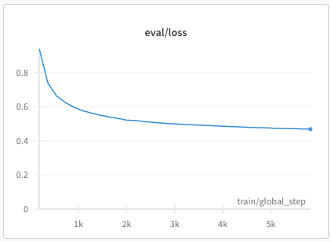

# Extending Llama to a new language
Authored by : Sarvam team
In this recipe, we will see how to add a new language to the Llama family of models. The steps are quite general and can be easily adapted to other models as well. Using this recipe, you should be able to replicate the findings of [OpenHathi](https://huggingface.co/sarvamai/OpenHathi-7B-Hi-v0.1-Base).
Please read more about OpenHathi [here](https://www.sarvam.ai/blog/announcing-openhathi-series)
## Data
The original OpenHathi model uses a combination of [Sangraha](https://huggingface.co/datasets/ai4bharat/sangraha) and Wikipedia as its primary data sources. If the reader is interested in using these sources, they would also have to preprocess the data: clean, filter, and deduplicate. See [Setu](https://github.com/AI4Bharat/setu) for an easy way to do this at scale.

In this tutorial, we will use the [Varta](https://huggingface.co/datasets/rahular/varta) dataset which contains 40M+ news articles taken from [DailyHunt](https://m.dailyhunt.in/). Since this data is already high-quality, we can skip the pre-processing step mentioned above. We will use the Hindi subset here, but you can add any other language present in the dataset by only passing the right language code (advanced users can also tweak the code to add multiple languages at once).

## Tokenizer
Our first step towards augmenting a new language to an LLM is creating a better tokenizer. We define 'better' in terms of fertility score or the number of in-language tokens present in the tokenizer. Note that we should add new tokens without disturbing the original vocabulary, and therefore creating a better tokenizer usually involves 2 steps: (i) building a new, in-language only tokenizer, and (ii) merging this new tokenizer with the original.

### Building the in-language tokenizer
For this, we will first download and prepare the data for training the tokenizer:

```
python prepare_data.py --split=validation --lang=hi --docs_to_sample=10000 --save_path=./data
```

Here we sample 10,000 Hindi documents from the validation split (we should ideally sample from the training split, but this is much faster) and save it as a text file inside `./data`. Next, we use this text to train a Hindi-only [sentencepiece](https://github.com/google/sentencepiece) tokenizer with a vocabulary size of 16,000.

```
python train_tokenizer.py --data_file=./data/hi.txt --save_path=./hi_tokenizer --vocab_size=16000
```

This creates a new sentencepiece Hindi tokenizer and saves it in `./hi_tokenizer`.

### Merging the tokenizers
This process can again be divided into 2 steps:
- add new tokens to the original Llama2 tokenizer without disturbing its original vocabulary in any way
- expand the input and output embedding matrices of Llama2 to be equal to the new vocabulary size

We can do the first step by (i) downloading Llama2's `tokenizer.model` file, (ii) loading our Hindi `tokenizer.model` file, (iii) appending the Hindi tokens to Llama2 tokenizer's vocabulary if they are not already present, and (iv) save the extended tokenizer for future use. All this can be done by running

```
python extend_tokenizer.py --new_tokenizer_path=./hi_tokenizer --extended_tokenizer_save_path=./extended_tokenizer
```

Now, you have a new Llama2 tokenizer which works the same way on English text but can efficiently tokenize Hindi words as well. You can also test to see if it works as intended:

```
>>> from transformers import LlamaTokenizer
>>> llama_tokenizer = LlamaTokenizer.from_pretrained('meta-llama/Llama-2-7b-chat-hf')
>>> our_tokenizer = LlamaTokenizer.from_pretrained('./extended_tokenizer')
>>> for i in range(len(llama_tokenizer)):
...     assert llama_tokenizer.convert_ids_to_tokens(i) == our_tokenizer.convert_ids_to_tokens(i), f"Token mismatch at index {i}."
...
>>> text = "मैं एक अच्छा हाथी हूँ"
>>> llama_tokenizer.tokenize(text)
['▁', 'म', 'ै', 'ं', '▁', '<0xE0>', '<0xA4>', '<0x8F>', 'क', '▁', 'अ', 'च', '्', '<0xE0>', '<0xA4>', '<0x9B>', 'ा', '▁', 'ह', 'ा', 'थ', 'ी', '▁', 'ह', 'ू', '<0xE0>', '<0xA4>', '<0x81>']
>>> our_tokenizer.tokenize(text)
['▁मैं', '▁एक', '▁अच', '्', 'छा', '▁हाथी', '▁हूँ']
```

## Continual pre-training
OpenHathi uses a two-stage pre-training process:
- Phase 1: learn to translate paragraphs of text (use translated text as context and generate the original text, ~15B tokens)
- Phase 2: bilingual next token prediction (train on text where the language changes after every sentence, ~15B tokens)

Note: OpenHathi's final data mixture also contains monolingual data and romanized transliterations.

We can easily create data for both phases using any translation model. OpenHathi uses [IndicTrans2](https://github.com/AI4Bharat/IndicTrans2). We provide sample code for both phases below.

### Phase 1
With the assumption that we don't have source-native data, let us first get some English data to translate.

```
from datasets import load_dataset
ds = load_dataset("rahular/varta", split="train", streaming=True)
english_paragraphs = []
for d in ds:
    if d["langCode"] != "en": continue
    english_paragraphs.append(" ".join(d["text"].split("\n")))
```

Now, our goal is to create data in the format `{translated_paragraph}\n\n{english_paragraph}`. We can use the `translate_paragraph` function ([link](https://github.com/AI4Bharat/IndicTrans2/blob/main/huggingface_interface/example.py#L150])) from the IndicTrans2 codebase to do this easily.

```
quantization = ""
en_indic_ckpt_dir = "ai4bharat/indictrans2-en-indic-1B"
en_indic_tokenizer, en_indic_model = initialize_model_and_tokenizer(en_indic_ckpt_dir, "en-indic", quantization)
ip = IndicProcessor(inference=True)

phase1_data = []
for para in english_paragraphs:
    trans_para = translate_paragraph(para, "eng_Latn", "hin_Deva", en_indic_model, en_indic_tokenizer, ip)
    phase1_data.append({"text": f"{trans_para}\n\n{para}"})

# if you want to save it for future, you can do so easily with HF datasets
from datasets import Dataset
phase1_ds = Dataset.from_list(phase1_data)
phase1_ds.save_to_disk("data/phase1")
```

### Phase 2
This is almost the same as phase 1, except that we have to replace the original sentences in an alternating manner to get the data in the required format. We can use the `split_sentences` ([link](https://github.com/AI4Bharat/IndicTrans2/blob/main/huggingface_interface/example.py#L60])) and `batch_translate` ([link](https://github.com/AI4Bharat/IndicTrans2/blob/main/huggingface_interface/example.py#L109)) functions to do this.

```
quantization = ""
en_indic_ckpt_dir = "ai4bharat/indictrans2-en-indic-1B"
en_indic_tokenizer, en_indic_model = initialize_model_and_tokenizer(en_indic_ckpt_dir, "en-indic", quantization)
ip = IndicProcessor(inference=True)

phase2_data = []
for para in english_paragraphs:
    en_sents = split_sentences(para, "eng_Latn")
    trans_sents = batch_translate(input_sentences, "eng_Latn", "hin_Deva, en_indic_model, en_indic_tokenizer, ip)
    final_para = []
    for idx, (en_sent, trans_sent) in enumerate(zip(en_sents, trans_sents)):
        sent_to_append = en_sent if idx % 2 == 0 else trans_sent
        final_para.append(sent_to_append)
    phase2_data.append({"text": " ".join(final_para)})

# if you want to save it for future, you can do so easily with HF datasets
from datasets import Dataset
phase2_ds = Dataset.from_list(phase2_data)
phase2_ds.save_to_disk("data/phase2")
```

### Train
Finally, we can start finetuning Llama2 on these datasets by following the [finetuning recipes](../../quickstart/finetuning/). Remember to pass the new tokenizer path as an argument to the script: `--tokenizer_name=./extended_tokenizer`.

OpenHathi was trained on 64 A100 80GB GPUs. Here are the hyperparameters used and other training details:
- maximum learning rate: 2e-4
- minimum learning rate: 2e-6
- optimizer: AdamW (weight decay = 0.1)
- beta1: 0.9
- beta2: 0.95
- lora rank: 128
- lora alpha: 64
- lora trainable: q_proj, v_proj, k_proj, o_proj, gate_proj, down_proj, up_proj
- lora dropout: 0.05
- block size: 4096
- global batch size: 4M tokens
- input and output embeddings are trainable
- lr schedule: cosine decay with warmup (warmup ratio = 0.1, number of cycles = 3)
- deepspeed stage 2
- dtype: bfloat16

The resulting (partial) loss plots from the OpenHathi training are shown below:

Phase 1: train loss


Phase 1: eval loss



Phase 2: train loss


Phase 2: eval loss


